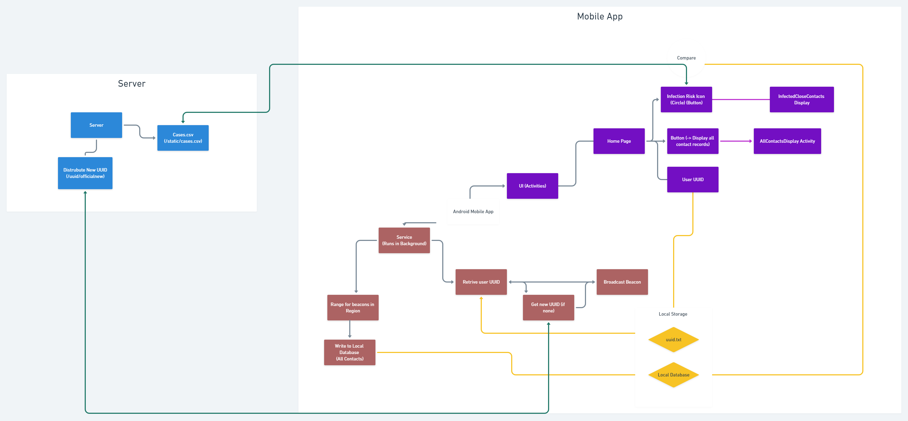

# Covid19-IBecon-Project
# Project Summary
In early Febuary 2020, I had the original idea of using the Bluetooth module on everyone's mobile phone to emulate the functionality of a Bluetooth IBeacon transmitter and reciever to keep track of all close contacts and alert citizens of possible transmissions at the first instance in a privacy centric and hassle free manner. As I spent the next 4-5 months learning how to create both Android and IOS mobile apps and working on a fully functional prototype*, experts from some countries like Singapore and the UK later came up with and implemented the same idea sucessfully. Apple and Google also developed the Exposure Notification API in April 2020, adopting the same technology and a similar privacy centric system architecture. This implementation was then proposed to the government in July 2020. Ultimately, due to various factors/considerations, another implementation involving QR Codes was chosen for HKSAR (Leave Home Safe).

Note: This Repo only contains the Android Prototype. Please see the following repos for:

- The IOS Prototype (unfortunately it is not possible to autostart the app (other than apple's own Exposure Notification API) due to limitations imposed by IOS/ Apple - as discovered by other teams working on this project as well): [Insert Link]

- The Python Flask Server for distributing IBeacon UUIDs (Yes although the chance of getting the same UUID/Major/Minor value is astronomically small, I thought having a centralized annoymous UUID Distribution system (increments the UUID that is to be distributed for each invocation) would be agreat idea despite drawbacks like scalability and cost): [Insert Link]

# System Diagram

________________________________________

# Project Update
Dear all, after posponding the development of the project as there were no local infection cases in HKSAR, China, the project is restarted in light of the recent sudden increase in cases. Different functionalities will be added as soon as possible. Please refer to the timeline in the wiki for more information.

Furthermore, this project, which is currently clossed sourced might be open sourced soon to allow scrutiny from data security experts. Input will be needed if the app is to be rolled out to the millions of citizens living in the city of Hong Kong to ensure that the system will be safe.

# Original Readme
Both Android and IOS phones are able to act as I-Beacon Transmitters. Every single citizen will install this app onto their phones. A database will be created on each phone locally for cost contacts with the fields : 'I-Beacon ID, Date, Time, Signal Strength, Signal Duration'. If someone is to be infected and confirmed, the I-Beacon ID will be recorded onto the server. All apps from the phone will check with the server and compare those lists of IDs with the close contact I-Beacon IDs. If a person is deemed a close contact, the date and time of contact will be uploaded to the server database as close contact, ring 1. All phones will also compare their list of close contacts with the 'close contact database' on the server to find close contact 1, 2 , 3, and so on in no time to prevent further spread. This app will NOT record the location of citizens and thus there will be no worry of security issues. Idea by a 14 Years Old living in HKSAR, China. 

Branches:
### Android App V1: Android Studio Java Android App Project

### csvmanagement: Python Flask Server code 

Notes on limitations:
* The server is now hosted on a digital ocean's cheapest droplet ($5 per month) with nginx and auto-restart incase the server stops for whatever reason.
Confirmed Patients must be imported in the correct format or it will causes crashes on the phone - 
            solution(s): 
                1: Add tolerence on App
                2: Add checking when doing csv input through api
